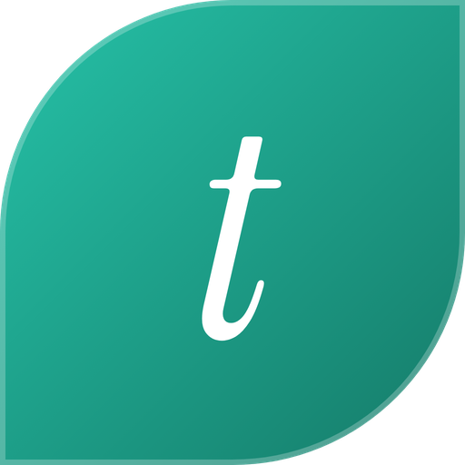

# teas.co.uk MCP server

teas.co.uk is a UK online tea shop. This repository is the public listing for its hosted
[Model Context Protocol](https://modelcontextprotocol.io) server, which lets AI assistants search the live catalogue of
tea, coffee and hot chocolate, compare products, find recipes, build a basket and hand over to a secure checkout on
teas.co.uk.

| | |
|---|---|
| Endpoint | `https://teas.co.uk/mcp` (Streamable HTTP) |
| Official MCP Registry | [teas.co.uk](https://registry.modelcontextprotocol.io/v0.1/servers/uk.co.teas%2Fshop/versions/latest) |
| Website and setup guide | https://teas.co.uk/ai/ |
| Sign in | Not needed to shop. OAuth 2.1 (`https://teas.co.uk/oauth`) only for account tools |

## What it does

- **Search** more than 600 teas, coffees and hot chocolates in plain words, with filters for type, caffeine, milk,
  time of day, strength, pack size, price per cup and organic, Fairtrade or vegan labels. Live prices in pounds
  including VAT, and live stock.
- **Product details** with tasting notes, a brewing guide with a timer, caffeine and allergy notes, and recipes.
- **Compare** two to four products side by side.
- **Recipes** from the teas.co.uk library (iced teas, lattes, chai, baking with tea; no alcohol).
- **Basket and checkout**: build a basket and get a secure link to pay on teas.co.uk. Payment never happens in the
  chat and the server cannot place an order.
- **Account** (after the customer links their teas.co.uk account): recent orders and courier tracking, buy again,
  pause, resume or cancel repeat deliveries, reward points and return requests.

Clients that support MCP Apps (for example ChatGPT, Claude and Mistral Vibe) show interactive product, basket and
order cards.

## Add it to your assistant

| Assistant | How |
|---|---|
| Claude | Customize, Connectors, Add custom connector: name `teas.co.uk`, URL `https://teas.co.uk/mcp` |
| Grok | grok.com, Connectors, New Connector, Custom: name `teas.co.uk`, URL `https://teas.co.uk/mcp` |
| Mistral Vibe | Context, Connectors, Add connector, Add custom connector: `https://teas.co.uk/mcp` |
| Perplexity (Pro, Max, Enterprise) | Connectors, custom connector: `https://teas.co.uk/mcp` |
| Claude Code | `claude mcp add --transport http teas.co.uk https://teas.co.uk/mcp` |
| Claude Code plugin | `/plugin marketplace add leestucker/teas-co-uk-mcp`, then `/plugin install teas-co-uk@teas-co-uk` (the MCP server plus the teas.co.uk skill) |
| ChatGPT | The app is in OpenAI's review. Until it is listed, with developer mode on: Settings, Apps, Create app: name `teas.co.uk`, MCP server URL `https://teas.co.uk/mcp`, no authentication |
| Gemini app (US) | gemini.google.com, Settings, Connected Apps, under Custom apps choose Add a custom app: `https://teas.co.uk/mcp` (US, 18 or over, personal Google Account). Works in Gemini Spark on the web and phone |
| Gemini Enterprise (Business edition) | A team administrator: Settings and help, the team, Manage team, Connected apps, Add MCP Server: `https://teas.co.uk/mcp`, no authentication |
| Antigravity (replaced Gemini CLI on 18 June 2026) | `agy plugin install https://github.com/leestucker/teas-co-uk-mcp` (this repo has `plugin.json`, `mcp_config.json` and a skill), or add `{"mcpServers": {"teas-co-uk": {"serverUrl": "https://teas.co.uk/mcp"}}}` to your MCP config |
| Gemini CLI (accounts it still serves) | `gemini extensions install https://github.com/leestucker/teas-co-uk-mcp` |
| Microsoft Copilot Studio | Agent, Tools, Add a tool, New tool, Model Context Protocol: name `teas.co.uk`, URL `https://teas.co.uk/mcp`, authentication None (OAuth 2.0 with Dynamic discovery to link a customer account). Or import [copilot-studio/teas-co-uk-mcp.yaml](copilot-studio/teas-co-uk-mcp.yaml) as a custom connector in Power Apps |
| Microsoft 365 Copilot | An administrator adds `https://teas.co.uk/mcp` as a bring your own MCP server in the Microsoft 365 admin center, then it is available in Copilot Studio agents |
| Cursor | Add to `~/.cursor/mcp.json`: `{"mcpServers": {"teas.co.uk": {"url": "https://teas.co.uk/mcp"}}}` |
| VS Code and GitHub Copilot | Add to `.vscode/mcp.json`: `{"servers": {"teas.co.uk": {"type": "http", "url": "https://teas.co.uk/mcp"}}}` |
| Windsurf | Cascade, Manage MCPs, Add Server, or add to `~/.codeium/windsurf/mcp_config.json`: `{"mcpServers": {"teas.co.uk": {"serverUrl": "https://teas.co.uk/mcp"}}}` |
| Zed | Add to settings.json: `{"context_servers": {"teas.co.uk": {"url": "https://teas.co.uk/mcp"}}}` |
| JetBrains AI Assistant (2026.1 or later) | Settings, Tools, AI Assistant, Model Context Protocol, Add: `{"mcpServers": {"teas.co.uk": {"url": "https://teas.co.uk/mcp"}}}` |
| Goose | Add Extension, Remote Extension (Streamable HTTP): name `teas.co.uk`, URL `https://teas.co.uk/mcp` (in `config.yaml`: `type: streamable_http`, `uri: https://teas.co.uk/mcp`) |
| Continue | In `~/.continue/config.yaml` under `mcpServers`: `- name: teas.co.uk`, `type: streamable-http`, `url: https://teas.co.uk/mcp` |
| LM Studio (0.3.17 or later) | Add to `mcp.json`: `{"mcpServers": {"teas.co.uk": {"url": "https://teas.co.uk/mcp"}}}` |
| Raycast | Install MCP Server: name `teas.co.uk`, transport HTTP, URL `https://teas.co.uk/mcp` |
| Cline | See [llms-install.md](llms-install.md) |
| Any MCP client | Streamable HTTP at `https://teas.co.uk/mcp` |
| NLWeb clients | `https://teas.co.uk/ask?query=...` (Microsoft's NLWeb protocol: schema.org results, streamed or `streaming=false` JSON; read only) |

## Tools

| Tool | What it does | Sign in |
|---|---|---|
| `find_products` | Search the live catalogue | No |
| `get_product` | Full details of one product | No |
| `compare_products` | Two to four products side by side | No |
| `find_recipes` | Recipes from the teas.co.uk library | No |
| `delivery_and_returns` | Delivery prices, countries and the returns policy | No |
| `add_to_basket` | Add products to a basket kept on teas.co.uk | No |
| `view_basket` | Show the basket with a delivery estimate | No |
| `update_basket` | Change a quantity or remove a product | No |
| `checkout_link` | Secure link to pay for the basket on teas.co.uk | No |
| `checkout_session` | Checkout for specific products straight away | No |
| `get_profile` | Which teas.co.uk account is linked | Yes |
| `my_orders` | Recent orders | Yes |
| `track_order` | Status and courier tracking for one order | Yes |
| `reorder` | Buy an earlier order again | Yes |
| `my_subscriptions` | Repeat deliveries | Yes |
| `change_subscription` | Pause, resume or cancel a repeat delivery | Yes |
| `rewards_balance` | Reward points | Yes |
| `start_return` | Send a return request for review | Yes |

## Privacy and terms

- Privacy policy: https://teas.co.uk/privacy-policy/
- Terms: https://teas.co.uk/terms-and-conditions/
- Contact: https://teas.co.uk/contact-us/ or hello@teas.co.uk

## About this repository

This repository describes the hosted service and holds its listing files: `server.json` (official MCP Registry),
`plugin.json` and `mcp_config.json` (Antigravity plugin), `gemini-extension.json` (Gemini CLI),
`skills/teas-co-uk/SKILL.md` (an Agent Skill for any assistant that reads skills),
`copilot-studio/teas-co-uk-mcp.yaml` (Copilot Studio and Power Apps custom connector), `llms-install.md` and the logo.
The server is run by teas.co.uk at `https://teas.co.uk/mcp`; its source code is not published here.
